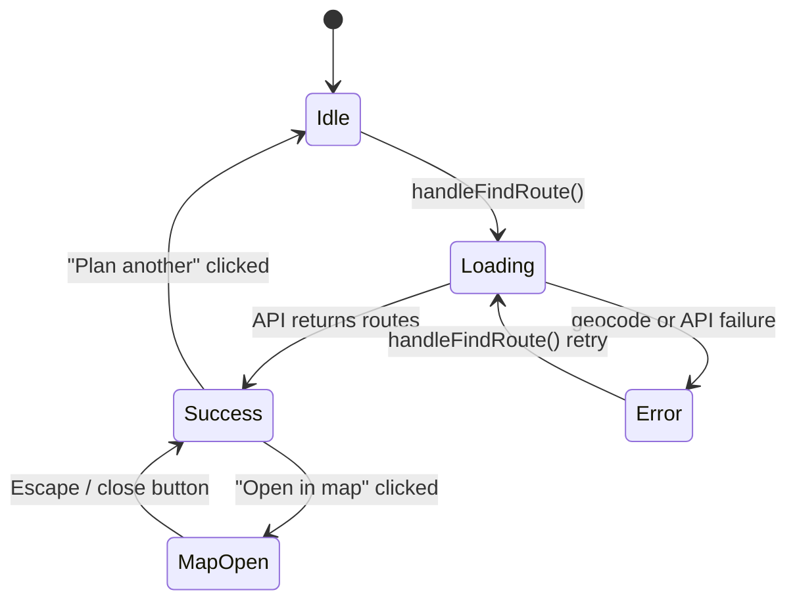

# Design Document

## Overview

This feature wires the existing `RoutePlannerSection` form to the real geocoding and routing APIs, then surfaces the returned routes inside the existing `MapModal`/`MapView` components. The majority of the plumbing already exists; the design focuses on the data-flow contract between the form, the APIs, and the map overlay, plus the error-handling and loading states that make the experience reliable.

The integration is entirely client-side. No new backend endpoints are required. The three moving parts are:

1. **Geocoding** — `geocodeApi.js` converts address strings to `{ lat, lng }` via OlaMaps.
2. **Route fetch** — `routeApi.js` POSTs origin/destination coords to `POST /api/score` and returns an array of `Route` objects.
3. **Map display** — `MapModal` wraps `MapView`, which renders OlaMaps polylines from the route array.

---

## Architecture

```mermaid
flowchart TD
    User -->|types address| RoutePlannerSection
    RoutePlannerSection -->|geocodeAddress| geocodeApi
    geocodeApi -->|OlaMaps Geocoding API| OlaMapsGeo[OlaMaps Geocoding]
    OlaMapsGeo -->|{ lat, lng }| geocodeApi
    geocodeApi --> RoutePlannerSection
    RoutePlannerSection -->|fetchRoutesData| routeApi
    routeApi -->|POST /api/score| BackendAPI[localhost:3300]
    BackendAPI -->|Route[]| routeApi
    routeApi --> RoutePlannerSection
    RoutePlannerSection -->|routes, mapCoords| MapModal
    MapModal --> MapView
    MapView -->|OlaMaps SDK| OlaMapsMap[OlaMaps Map]
```

### State machine for RoutePlannerSection



---

## Components and Interfaces

### RoutePlannerSection (existing, extended)

Owns all form state and orchestrates the geocode → fetch → display flow.

Key state additions / clarifications:

| State var | Type | Purpose |
|---|---|---|
| `routes` | `Route[] \| null` | Returned from RouteAPI; passed to MapModal |
| `mapCoords` | `{ lat, lng } \| null` | Origin coords; used to center the map |
| `showMap` | `boolean` | Controls MapModal visibility |
| `error` | `string \| null` | Inline error message |
| `isSearching` | `boolean` | Loading state; disables submit button |

`handleFindRoute` flow:
1. Resolve origin: use `geoCoords.current` if `startingPoint === 'My current location'`, else call `geocodeAddress(startingPoint)`.
2. Call `geocodeAddress(destination)`.
3. Call `fetchRoutesData({ originLat, originLng, destLat, destLng })`.
4. On success: set `routes`, `mapCoords`, `result = 'success'`.
5. On any error: set `error` message, stay in form state.

### geocodeApi.js (existing, no changes needed)

```ts
geocodeAddress(address: string): Promise<{ lat: number, lng: number }>
```

Throws with a descriptive message when the OlaMaps API returns no results or a non-OK status.

### routeApi.js (existing, no changes needed)

```ts
fetchRoutesData(postData: {
  originLat: number,
  originLng: number,
  destLat: number,
  destLng: number,
}): Promise<Route[]>
```

Throws with `API error: <status>` on non-OK responses.

### MapModal (existing, no changes needed)

```ts
MapModal({
  routes: Route[],
  latitude: number,
  longitude: number,
  onClose: () => void,
})
```

Renders full-screen overlay. Closes on Escape key or close button click. Prevents body scroll while open.

### MapView (existing, no changes needed)

```ts
MapView({
  latitude: number,
  longitude: number,
  routes: Route[],
})
```

Initialises OlaMaps SDK, draws polylines for each route, adds start/end markers, supports click-to-highlight.

---

## Data Models

### Route

```ts
interface Route {
  routeId: string;           // unique identifier, used as map layer/source id
  polyline: [number, number][]; // array of [lng, lat] pairs
}
```

### GeocoderResult

```ts
interface GeocoderResult {
  lat: number;
  lng: number;
}
```

### RouteAPIPayload

```ts
interface RouteAPIPayload {
  originLat: number;
  originLng: number;
  destLat: number;
  destLng: number;
}
```

### Component State Shape (RoutePlannerSection)

```ts
{
  startingPoint: string;
  destination: string;
  isSearching: boolean;
  result: null | 'success';
  activeFilters: string[];
  locating: boolean;
  error: string | null;
  routes: Route[] | null;
  mapCoords: { lat: number; lng: number } | null;
  showMap: boolean;
}
```


---

## Correctness Properties

*A property is a characteristic or behavior that should hold true across all valid executions of a system — essentially, a formal statement about what the system should do. Properties serve as the bridge between human-readable specifications and machine-verifiable correctness guarantees.*

### Property 1: Pipeline failure sets error state

*For any* failure thrown during `handleFindRoute` (whether from `geocodeAddress` for origin, `geocodeAddress` for destination, or `fetchRoutesData`), the component's `error` state SHALL be set to a non-empty string and `result` SHALL remain `null`.

**Validates: Requirements 1.2, 2.4**

### Property 2: Successful fetch stores routes and transitions to success

*For any* valid `Route[]` returned by `fetchRoutesData`, after `handleFindRoute` completes the component's `routes` state SHALL equal the returned array and `result` SHALL equal `'success'`.

**Validates: Requirements 2.3**

### Property 3: Route API payload matches resolved coordinates

*For any* origin `{ lat, lng }` and destination `{ lat, lng }` resolved by the geocoder, `fetchRoutesData` SHALL be called with exactly `{ originLat: origin.lat, originLng: origin.lng, destLat: dest.lat, destLng: dest.lng }`.

**Validates: Requirements 2.1**

---

## Error Handling

| Failure point | Trigger | User-visible effect |
|---|---|---|
| Geocode origin fails | OlaMaps returns no results or non-OK status | Inline error banner with message from thrown Error |
| Geocode destination fails | Same as above | Same |
| RouteAPI non-OK response | `response.ok === false` | Inline error banner: `"API error: <status> <statusText>"` |
| RouteAPI network error | `fetch` rejects | Inline error banner with caught error message |
| Geolocation unavailable | `navigator.geolocation` absent or denied | Starting point field set to `"Location unavailable"` |

All errors are caught in the single `try/catch` block inside `handleFindRoute`. The `finally` block always clears `isSearching`. The error state is cleared on each new submission attempt.

---

## Testing Strategy

### Unit Tests

Focus on specific examples, edge cases, and integration points:

- **Geocode bypass**: when `startingPoint === 'My current location'` and `geoCoords.current` is set, `geocodeAddress` is NOT called for the origin (Requirement 1.3).
- **Loading state**: `isSearching` is `true` while the async pipeline is in flight; submit button is disabled (Requirement 2.2).
- **Success state UI**: when `result === 'success'`, the "Open in map" button is rendered (Requirement 3.1).
- **Map modal open**: clicking "Open in map" sets `showMap = true` and renders `MapModal` (Requirement 3.2).
- **Modal close on Escape**: pressing Escape calls `onClose` (Requirement 3.5).
- **Modal close on button**: clicking the close button calls `onClose` (Requirement 3.5).
- **Body scroll lock**: `document.body.style.overflow` is `'hidden'` while `MapModal` is mounted and restored on unmount (Requirement 3.6).

### Property-Based Tests

Use a property-based testing library (e.g., **fast-check** for JavaScript/React) with a minimum of **100 iterations per property**.

Each test must be tagged with a comment in the format:
`// Feature: route-planner-map-integration, Property <N>: <property_text>`

**Property 1 — Pipeline failure sets error state**
Generate: a random failure point (geocode origin, geocode destination, or fetchRoutesData) that throws a random error message.
Assert: `error` is a non-empty string, `result` is `null`, `isSearching` is `false`.
`// Feature: route-planner-map-integration, Property 1: pipeline failure sets error state`

**Property 2 — Successful fetch stores routes and transitions to success**
Generate: a random array of `Route` objects (random `routeId` strings, random polyline arrays of `[lng, lat]` pairs).
Assert: after `handleFindRoute` resolves, `routes` deep-equals the generated array and `result === 'success'`.
`// Feature: route-planner-map-integration, Property 2: successful fetch stores routes and transitions to success`

**Property 3 — Route API payload matches resolved coordinates**
Generate: random numeric lat/lng pairs for origin and destination.
Assert: `fetchRoutesData` is called with `{ originLat, originLng, destLat, destLng }` matching the generated values exactly.
`// Feature: route-planner-map-integration, Property 3: route API payload matches resolved coordinates`
